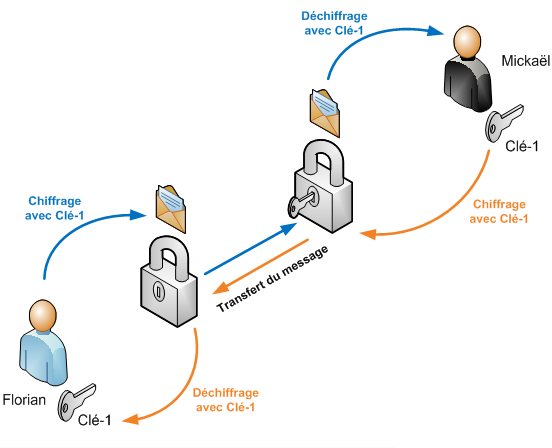
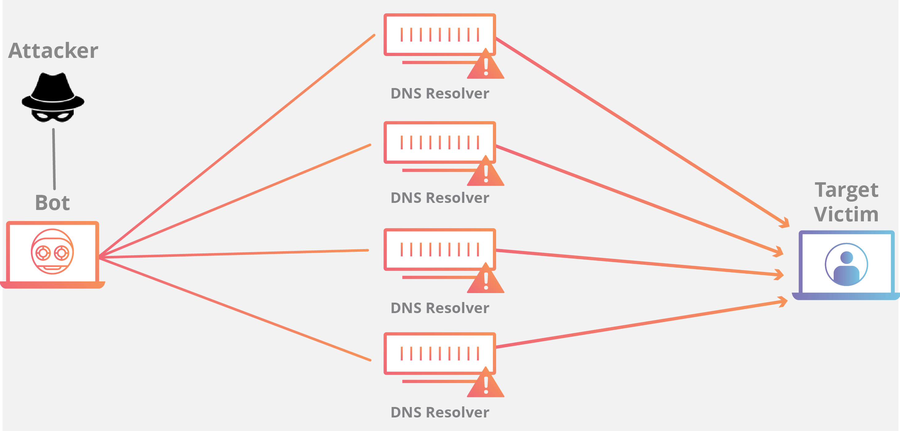
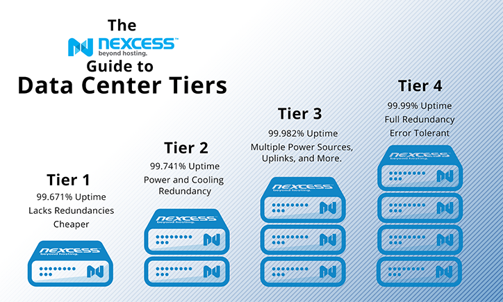
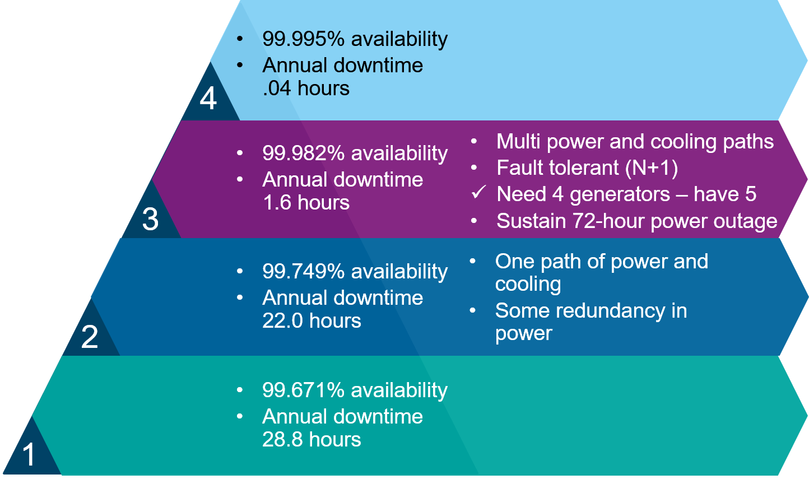

## 〉 Les avantages

  • Entretien et Performance

Le Cloud Computing évite de **gérer soi-même ses infrastuctures** ce qui comprend l'**achat de matériel**, de **logiciel**,  l'**alimentation** électrique, etc... En effet, les services de cloud computing s'occupent de l'état des serveurs afin de s'assurer d'un **bon fonctionnement** de chacun d'entre eux. Le client n'intervient donc à *aucun moment* sur la gestion des serveurs. Ces mêmes fournisseurs disposent d'un matériel informatique fréquemment mis à jour pour des **serveurs** toujours plus **fiables et performants**.

  • Adaptation 

Par ailleurs, la plupart des fournisseurs offre une **adaptation de la quantité de ressources informatiques** en fonction du besoin et cela au moment et à l'endroit où c'est nécessaire. Cela permet à l'entreprise d'avoir une facture correspondante exactement à son utilisation des serveurs. D'ailleurs, elle peut avoir accès à l'évolution détaillée de chaque serveur via une interface web simple et efficace.

 • Sécurité 

Plusieurs moyens sont proposés pour sécuriser les données au maximum.

 - Le **pare-feu réseau** (Firewall en anglais) est un système permettant de **protéger** un ordinateur ou un réseau d'ordinateurs, des **intrusions** provenant d'un **réseau tiers**. Il permet de **filtrer** les paquets de données échangés avec le réseau, il s'agit ainsi d'une **passerelle filtrante** permettant de contrôler l'accès aux applications.

 - Le **chiffrement des données** est utilisé pour empêcher toute personne de "lire" ces-dernières lorsqu'elles sont stockées. Dans ce cas, on utilise une *clé* (comparable à un mot de passe) pour les crypter (ou encoder) grâce à un **algorithme**. Une clé peut être stockée sur le système de réception, ou peut être transmise avec les données chiffrées. Pour avoir à nouveau accès a ces données, il est nécessaire d'avoir **la même clé** car elle est aussi utilisée pour le décryptage (ou décodage).

 - Des **options de connectivité** autorisant les connexions privées, ou dédiées, **limitent** les **connexions intrusives** et donc les risques de piratage.

 - Un mécanisme de **réponse automatique** aux attaques **DDoS** (pour Distributed Denial-of-Service) est fortement recommandé. Une attaque DDoS est une attaque informatique ayant pour but de rendre indisponible un service souvent en inondant un réseau. Un tel mécanisme permet de **réduire le temps** nécessaire pour **détecter** une attaque et donc **éviter** au maximum la "chute" des serveurs.

 - Pour être informé d'un quelconque évênement imprévu, des **notifications d'alertes** sont envoyées et accessibles via l'interface web du cloud.

S'il est essentiel de **protéger les données** stockées contre toutes menaces potentielles, c'est aussi un moyen de fidélisation. En effet, une forte sécurité des données mise en place par le fournisseur donne confiance au client pour utiliser leurs services.

 • Fructification des données 

Outre la sécurité, il est possible d'intégrer des services d'apprentissage automatique et d'intelligence artificielle pour faire **fructifier les données**. Il s'agit de faire analyser automatiquement l'ensemble de ses données et d'en faire ressortir des résultats et statistiques. Ils **facilitent** les **prévisions**, **accélèrent** les **prises de décisions** et rendent **accessibles** du **contenu pertinent** et intéressant.

## 〉 Les Inconvénients

 • Stockage 

Les serveurs et donc les informations qui y sont stockées sont **soumises aux lois** des pays où ils se situent. Or, les lois sont plus ou moins restrictives quant à l'utilisation des données confidentielles. Certains types de données critiques ne peuvent être stockés dans tous les pays. Il appartient donc au client d'être vigilant quant à la ****localisation de ses serveurs** pour n'encourir aucun risque.

 • Sécurité 

Même si la sécurité est plutôt considérée comme un avantage, il faut veiller à ce que les données soient stockées sur **plusieurs unités de stockage** et non pas une seule, et de préférence dans des **endroits différents**. Cette sécurité numérique doit être couplée à une sécurité physique. En d'autres termes, la protection des locaux est tout aussi fondamentale que la protection des données elles-mêmes. En effet, une intrusion d'une personne mal intentionnée pourrait avoir des conséquences très graves pour l'entreprise: *fuite d'informations confidentielles*, *pertes colossales d'argent*, *etc...*.

Les datacenters sont classés en 4 niveaux, du plus petit niveau (tiers 1) au plus haut (tiers 4). Le tiers 4 assure la totale sécurité du serveur lui-même, en terme d'alimentation électrique, de refroidissement des systèmes, etc... C'est le niveau à privilégier car il évite des incidents techniques majeurs. Ainsi, les entreprises sont amenées à visiter un des datacenter pour en vérifier son architecture.

 

 • Connexion

Une mauvaise connexion Internet peut entrainer la **chute de l'application** et donc des **services** proposés, synonyme de perte d'argent voir de clients. De ce fait, le cloud ne s'avère pas être un bon choix si la connexion Internet n'est pas suffisamment performante.

 • Productivité 

L'entreprise doit s'assurer que ses employés **maîtrisent** l'utilisation du **cloud** afin de ne pas le voir comme une contrainte voir un **frein**. Elle doit donc les former si nécessaire.

## 〉 Bilan

Le cloud computing intervient aujourd'hui dans toutes les situations qu'elles soient professionnelles ou personnelles. Il présente des **avantages considérables** offrant un partage d'une grande quantité d'informations à une vitesse sans précédent et ce partout dans le monde. Il a aussi ses limites car il suppose de se trouver à proximité des serveurs pour bénéficier des services de façon optimale et nécessite d'avoir conscience des inconvénients non négligeables en terme de sécurité. 
 - Veuillez ne pas *foncer tête baissée dans les nuages*..
