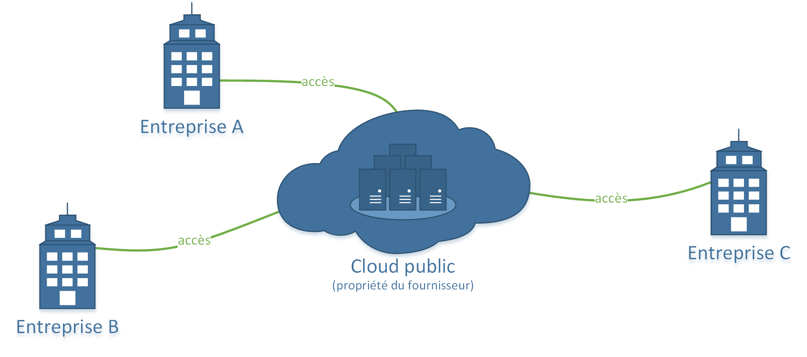
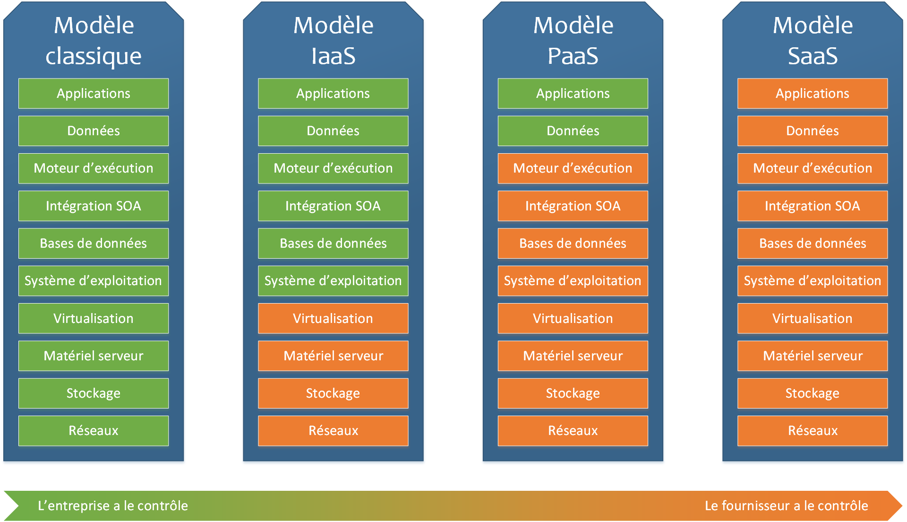
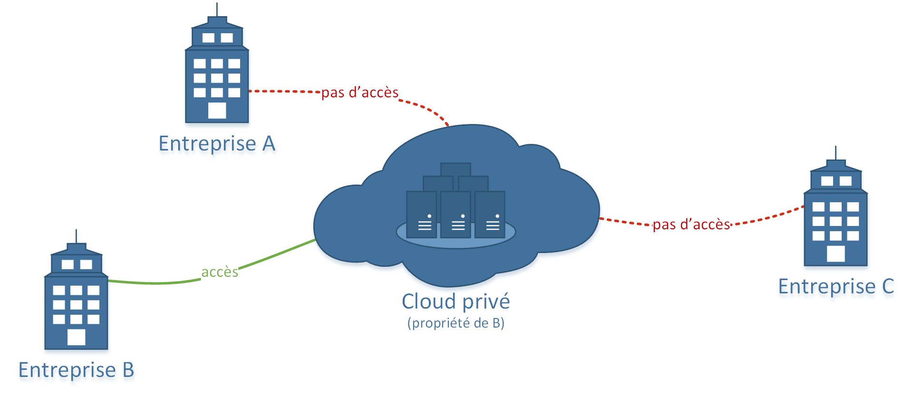
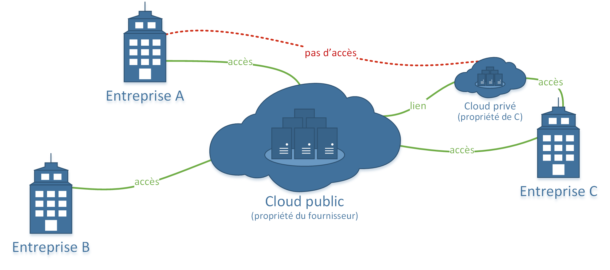

## 〉 Déploiements


```js
  Avant de sortir le porte monnaie, il faut déterminer le 'type de déploiement' cloud en fonction de son 'besoin'.
  Il en existe trois au total : le 'Cloud Public', le 'Cloud Privé' et le 'Cloud Hybride'.
```


<p class="titleStyled"> • Cloud Public</p>

Le Cloud Public est la forme la plus **courante** de cloud computing. Des fournisseurs comme *Amazon Web Services*, *Google Compute Engine*, ou *Microsoft Azure* ("les géants du web") mettent à disposition des **serveurs** répartis dans le monde entier toujours en **adaptant le coût** du/des serveur(s) à leur(s) utilisation(s). Toute l’infrastructure et les logiciels sont la **propriété du fournisseur** du cloud.
Les prix de ces serveurs varient en fonction de la **puissance de calcul**, la **capacité de stockage** ainsi que la **bande passante**.



La plupart des solutions de cloud public sont proposées en libre-service et à la demande. Cependant, différents types de services existent.

#### IaaS (Infrastucture as a Service)
 - Traduit littéralement par "Infrastructure en tant que service", c'est la forme la plus commune de cloud computing. Elle consiste à offrir à l'entreprise un parc informatique virtualisé. Des machines virtuelles sur lesquelles on peut installer un système d'exploitation et des applications sont mises à disposition. Pour utiliser ce type de solution, l'entreprise doit louer une infrastructure auprès d'un fournisseur.

#### PaaS (Platform as a Service)
 - Traduit en "Plateforme en tant que Service", cette solution est utilisée pour faciliter le développement, le test et la gestion d'applications sans se préoccuper de l'infrastucture, de la base de donnés et de la capacité de stockage mise à disposition.

#### SaaS (Software as a service)
 - En francais, "Logiciel en tant que Service", elle offre la possibilité d’utiliser des logiciels en ligne partagés sur le réseau. L'entreprise est ainsi dispensée de devoir les acheter, les installer et les mettre à jour, il suffit de souscrire à un abonnement "groupé" pour chaque utilisateur. Il est ainsi possible de se connecter aux applications par le biais d'un navigateur web. Cette solution est adaptable en fonction des besoins et du nombre d'utilisateurs.

 


<p class="titleStyled"> • Cloud Privé </p>

Un Cloud Privé est une infrastucture dédiée à **une seule entreprise**, se trouvant sur un réseau privé. Elle peut-être localisée au sein même de l'enteprise ou ailleurs (au quel cas il faudra payer un fournisseur). Il est ainsi possible de gérer, contrôler, sécuriser l'infrastucture facilement. L'avantage principal de ce type de cloud est qu'il offre la possibilité de **concevoir** cette infrastructure **sur-mesure** pour satisfaire les besoins de l'entreprise.



<p class="titleStyled"> • Cloud Hybride </p>

Le Cloud Hybride est un **croisement** entre le *Cloud public* et le *Cloud privé* lié par une technologie (sorte de *passerelle* entre les deux types de cloud) leur permettant de **partager des données** et des **applications**. L’objectif étant de tirer profit de chacun des deux types de clouds, le Cloud Hybride offre ainsi une plus grande **flexibilité** qu'un cloud public. Il propose une **optimisation de l'infrastructure** et un **contrôle total** sur les **données** stockées que l'on retrouverait dans un cloud privé.

 - Plusieurs possibilités sont offertes pour déployer du Cloud Hybride :
  - en utilisant différents fournisseurs de Cloud (un pour le public et un autre pour le privé).
  - en s'appuyant sur un seul fournisseur qui propose ces 2 modèles.
  - en possédant son propre Cloud Privé et en souscrivant à un fournisseur de Cloud Hybride.


