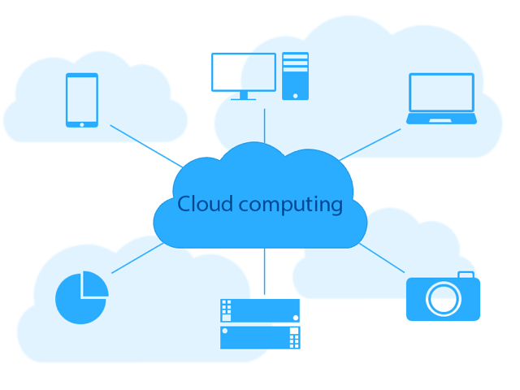

##  〉 Utilisations Générales
 - Le Cloud Computing.. ça sert à quoi, c'est destiné à qui?

Sous ce nom anglais, se cache une technologie innovante. Face à la mondialisation et devant la multitude d'informations échangées chaque seconde, il est nécessaire de disposer d'un système **rapide**, **fiable** et **planétaire**, c'est ce que fournit le cloud computing. Il pallie donc aux **besoins du quotidien** comme envoyer des mails, partager des documents ou des photos, regarder des films ou encore jouer à des jeux. On utilise tous le cloud computing sans même le savoir. D'ailleurs, de plus en plus d'entreprises, de start-ups, d'organisations s'intéressent à cette solution pour de nombreuses raisons telles que ;

```
  - Créer des applications et des services
  - Stocker, sauvegarder et récupérer des données
  - Héberger des sites web et des blogs
  - Diffuser du contenu audio et vidéo
  - Diffuser des logiciels à la demande
```


Les deux principales utilisations du cloud computing consistent à déployer une application et gérer une base de données. On les retrouve quasiment à chaque fois dans l'utilisation de cette technologie. Mais ils en existent une infinité : Elles se font en fonction de ce que l'entreprise propose comme services.




## 〉 Pour une Entreprise

Les entreprises ont besoin d'échanger un nombre incalculable de données à travers le monde avec leurs clients et fournisseurs. Elles sont donc confrontées à deux problèmes: d'une part le **volume important** de données transitant à travers le monde, d'autre part **la distance** entre les interlocuteurs. Le cloud computing y répond. En effet, il permet de louer des *centaines* voir des *milliers* de serveurs pour y stocker et échanger des informations. Les entreprises peuvent ainsi **déposer** les données souhaitées sur ces serveurs et permettre à leurs clients de *s'y connecter* pour les **récupérer**, les **utiliser**, voir en **déposer** eux-mêmes.
Ce partage nécessite toutefois une **répartition des serveurs** aux quatres coins du globe pour garantir une connexion rapide et fiable. Une entreprise se doit donc de **gérer ses infrastructures** efficacement en fonction de ses besoins et de sa clientèle.


## 〉 Pour un Particulier


Les particuliers peuvent également avoir recours aux services cloud mais dans d'autres proportions. En effet, il est possible de louer des serveurs **à l'unité** pour une utilisation simple de celui-ci. **Héberger un site web** ou gestionner une **base de données** sont les demandes les plus courantes. Pour cela, des services très répandus et très peu couteux ont vu le jour avec par exemple *OVH* qui propose un nom de domaine ainsi qu'un hébergement pour moins de 5€ par mois. Il est également possible de **créer son propre serveur** avec une *raspberry pi* (comparable à un mini-ordinateur programmable) par exemple. Le seul bémol de cette option est qu'il est nettement **moins sécurisé** qu'un serveur loué chez un fournisseur. Là où un fournisseur offre une certaine **sécurité automatiquement** et gratuitement, créer son propre serveur signifie devoir "créer" sa propre sécurité.
